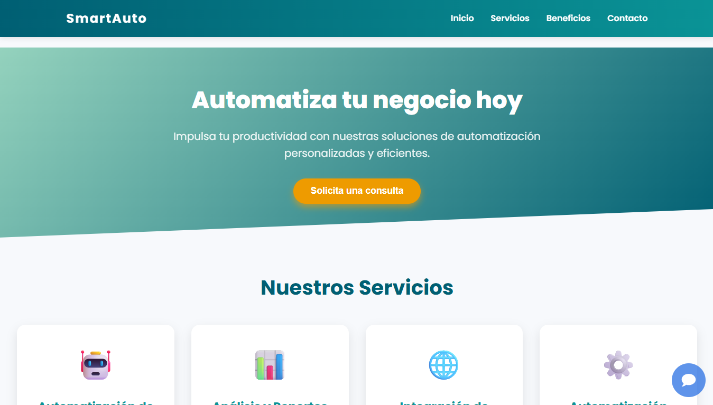
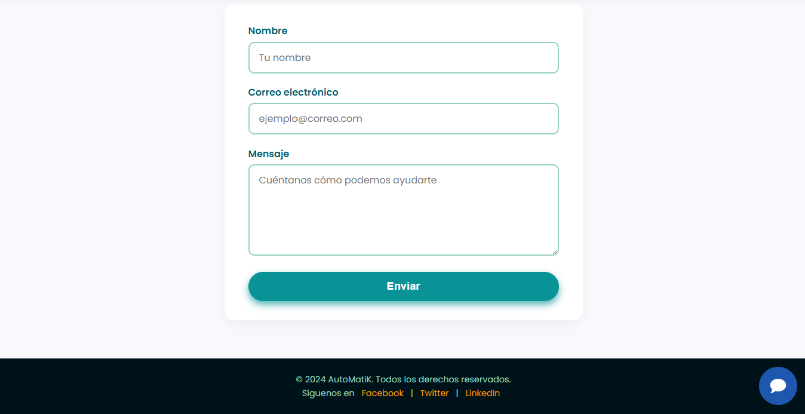

# Automatizaciones Empresariales - SmartAuto

Este proyecto es una página web desarrollada en HTML/CSS/JS diseñada para ofrecer soluciones de automatización a empresas. Brinda información clara sobre nuestros servicios, beneficios y casos de uso para mejorar la eficiencia operativa.

---

## 🚀 Funcionalidades

- Presentación clara de los servicios de automatización.
- Diseño responsivo y moderno.
- Secciones: Inicio, Servicios, Casos de éxito(en proceso (no van a haber casos reales por obvias razones)), Contacto.
- Formulario de contacto con validación básica.

---

## 💼 Casos de uso

- Automatización de procesos administrativos.
- Sincronización de agendas y tareas.
- Mejora del flujo de trabajo para equipos comerciales o técnicos.

---

## 📸 Vista previa

---
## 📈 Futuras mejoras
- Conexiones con n8n para el manejo de la informacion de los clientes
- Integracion de respuestas rapidas via e-mail para una respuesta rapida con los clientes

